# (C# 코딩) SimpleCalculator

## 개요
- C# 프로그래밍 학습

- 1줄 소개 : 사용자의 버튼 입력을 받아서 계산기 기능을 수행하는 프로그램

- 사용한 플랫폼 :
  - ```C#```, ```.NET Windows Forms```, ```Visual Studio 2026```, ```GitHub``` 
  
- 사용한 컨트롤 :  
    - ```Label,TextBox, Button```
    
- 사용한 기술과 구현한 기능 :
  - 사용한 기술과 구현한 기능 :
  - **Windows Forms 앱 (C#)**: `Visual Studio`의 디자이너를 활용하여 직관적인 계산기 UI(버튼, 2개의 텍스트박스) 구성
  - **이벤트 기반 프로그래밍**: `Button` 클릭 이벤트 핸들러(이벤트 객체 `sender` 변환 등)를 통합 구현하여 코드 중복 최소화
  - **문자열/수식 파싱**: `String.Substring()`, `Replace()`, 정규표현식(`Regex`) 등을 활용하여 수식 표기 변환, 수정/삭제 기능(C, CE, Del) 세밀한 예외 처리
  - **동적 수식 연산**: `DataTable.Compute()`를 도입하여 다중 피연산자 처리, 괄호 연산, 사칙연산 우선순위 등 윈도우 기본 계산기와 유사한 연산 로직 구현
  - **상태 관리**: 플래그 변수(`isCalculated`)를 활용하여 계산 완료 직후 이어지는 연산(숫자 입력 vs 연산자 입력)에 따른 자연스러운 흐름 제어 도입
 
- 화면 구성 : 
  
  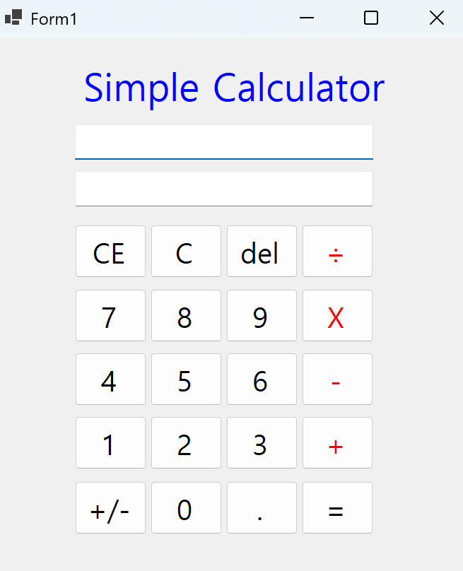

## 실행 화면 (과제1)

- 과제1 코드의 실행 스크린샷

  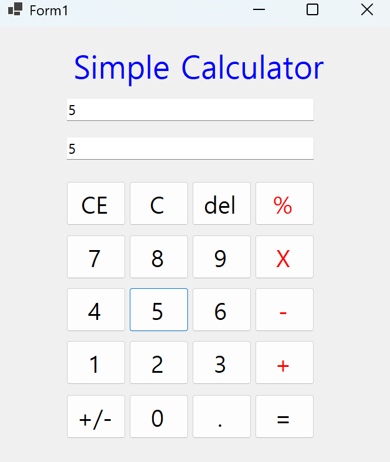 

  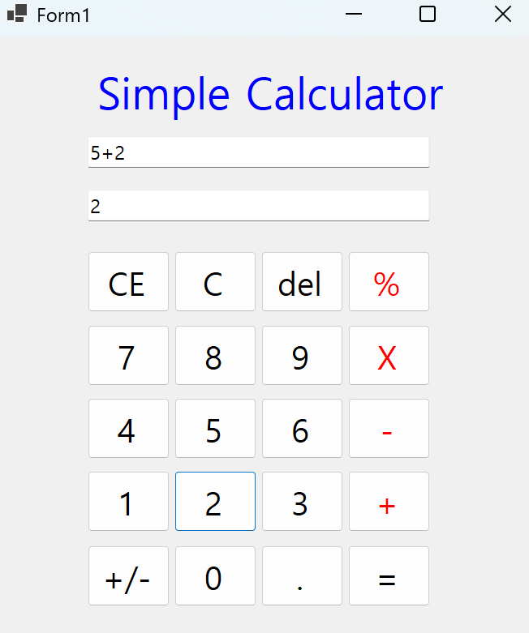 ```피연산자 입력 시 입력 TextBox와 결과 TextBox에 모두 표시```

  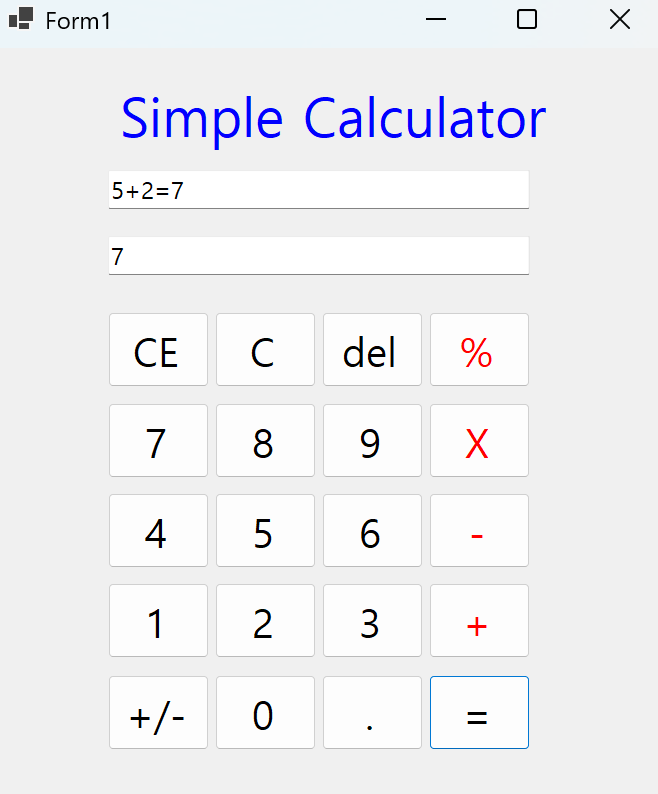  ```계산 버튼 클릭 시 결과 TextBox에 계산 결과 표시```

  - 과제 내용
    - 컨트롤 배치와 기본적인 속성 설정 
    - 입력 내용을 2가지 방법으로 표시하는 기능 구현
    - 계산기의 더하기 기능 구현
      
  - 구현 내용과 기능 설명
    - **UI 구성** : ```Label```(제목), ```TextBox```(입력표시,결과표시), ```Button```(계산)등을 적절히 배치
    - **숫자 입력 기능** : 숫자 ```Button``` 클릭 시 ```TextBox```에 2가지 방법으로 표시
    - **사칙연산 계산 기능** : 2개의 피연산자의 입력값을 Int로 바꾸어 더하기 계산을 수행하고 결과 저장
    - **계산 결과 출력**: 계산 결과 값을 문자열로 변환하여 표시
    
  - 사용한 기술과 구현한 기능
    - ```Label, TextBox, Button``` 컨트롤을 활용한 UI 구성
    - ```Button button = sender as Button;```을 활용해 이름을 사용하지 않고 클릭한 버튼을 참조
    - ```int.Parse()```를 활용해 문자열을 정수로 변환하여 계산 수행
    
  - 사칙연산 로직 구동 시나리오
    - 숫자 누르면 입력값 표시
    - 연산자 누르기
    - 연산자 입력 여부로 피연산자 순서 구분
    - 자료형 변환 후 계산 수행

## 실행 화면 (과제2)

- 과제2 코드의 실행 스크린샷

   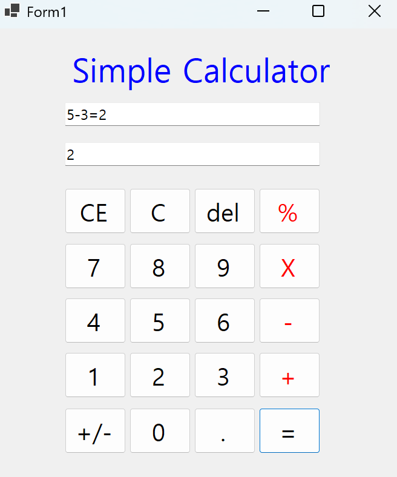 

   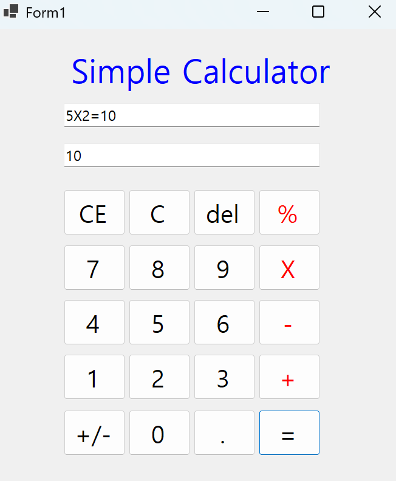 

   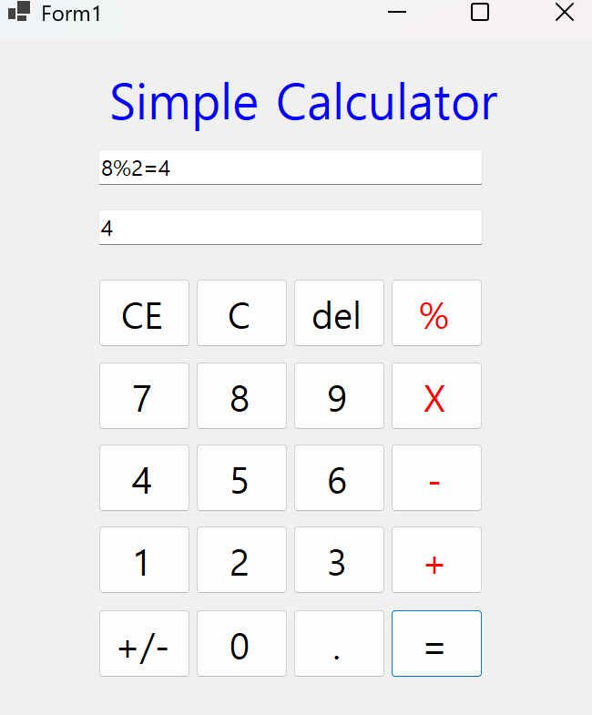 ```뻴셈, 곱셈, 나눗셈 결과 출력```


- 과제 내용
    - 빼기, 곱하기, 나누기 구현
      
- 구현 내용과 기능 설명
    - 뺄셈(-), 곱셈(*), 나눗셈(/) 버튼 클릭 시 각각의 연산 수행
   
- 사용한 기술과 구현한 기능
    - 기존 연산 로직에 ```switch```문을 활용해 연산자에 따른 계산 수행

   ```cs
    switch (currentOperator)
        {
            case "+":
                result = n1 + n2;
                break;
            case "-":
                result = n1 - n2;
                break;
            case "X":
                result = n1 * n2;
                break;
            case "÷":
                if (n2 != 0) result = n1 / n2;
        }
     ```
   
## 실행 화면 (과제3)

- 과제3 코드의 실행 스크린샷

    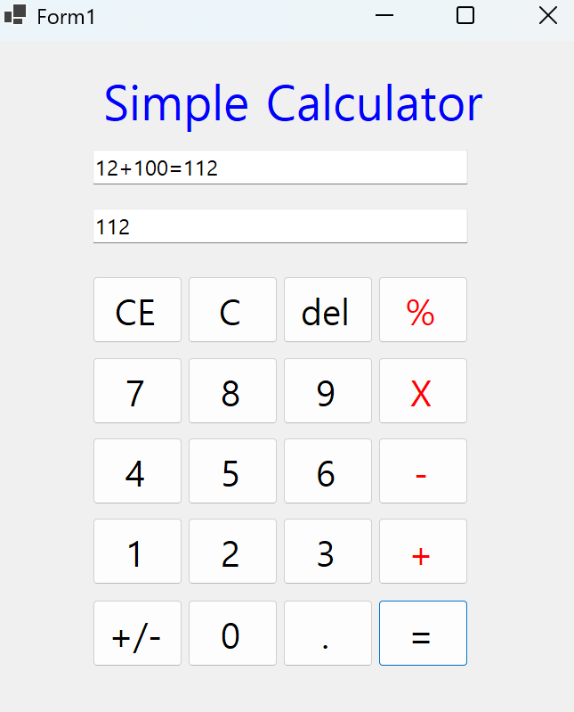 ```12 + 100 = 112 예시 ```
    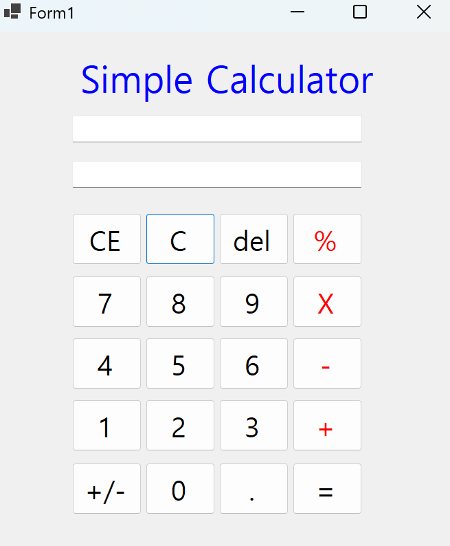 ```C버튼을 누르면 입력값과 결과값이 모두 초기화```
    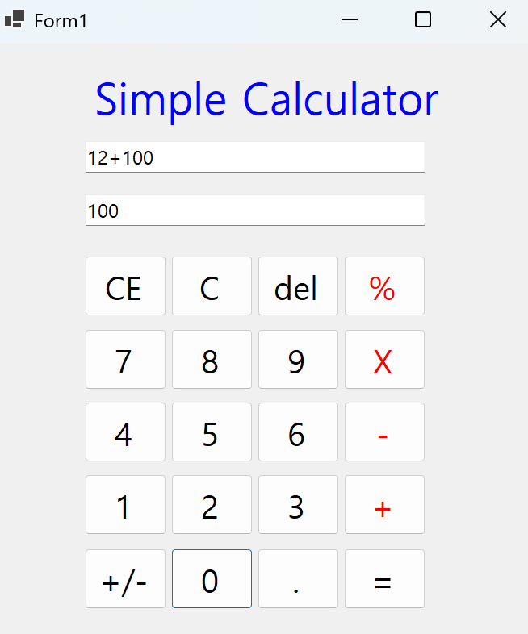 
    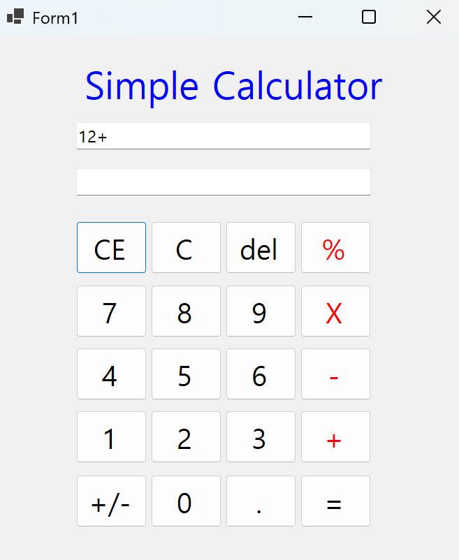 ```CE 버튼을 누르면 마지막으로 입력한 피연산자 삭제```
    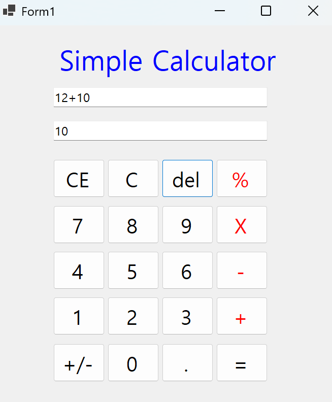 ```del 버튼을 누르면 입력값에서 마지막 글자 삭제```

- 과제 내용
    - 계산기에 있는 수정/삭제 기능 구현
    - C 버튼 
    - CE 버튼
    - Del 버튼

- 구현 내용과 기능 설명
    - C 버튼 : 현재의 모든 내용을 삭제하고 처음 상태로 되돌아감
    - CE 버튼 : 마지막으로 입력한 피연산자 삭제 (ex. 100 입력 후에 누르면 100값이 통째로 삭제)
    - Del 버튼 : 마지막으로 입력한 글자 삭제 (ex. 100 입력 후에 누르면 0 하나만 삭제되어 10이 됨)

- 사용한 기술과 구현한 기능
    - ```string.Substring()```과 ```string.Length```을 활용해 문자열에서 특정 부분을 추출하여 삭제 기능 구현
   
## 실행 화면 (과제4)

- 과제4 코드의 실행 스크린샷

    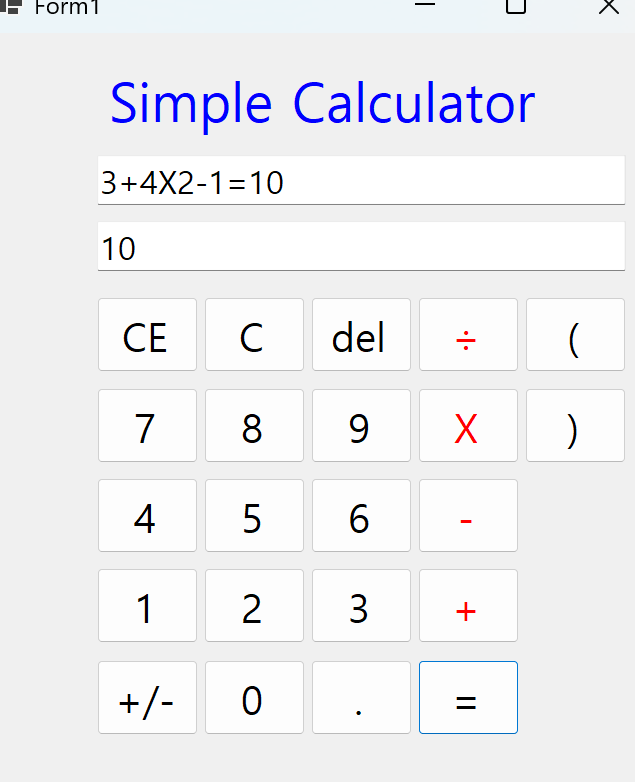
    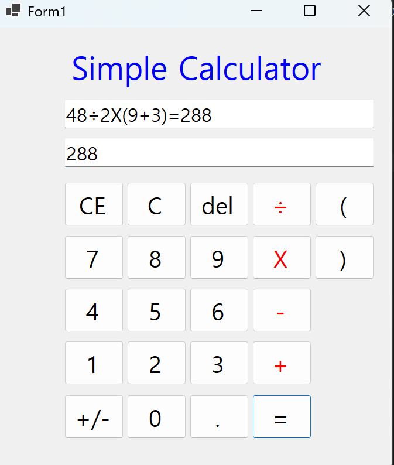
    
- 과제 내용
  - 사용자 편의 기능 추가
  - Windows의 계산기 참고해서 추가
    
- 구현 내용과 기능 설명
  - 기존의 피연산자 2개가 아닌 여러 개의 피연산자 입력과 연산이 가능하도록 구현
  - 사칙연산 우선순위 고려하여 계산 수행
  - 괄호 입력 기능 구현

- 사용한 기술과 구현한 기능
  - `DataTable.Compute()`를 활용하여 다중 피연산자와 사칙연산의 수학적 우선순위를 자동으로 처리하는 계산 로직 구현
  - `String.Replace()`를 사용하여 사용자가 보는 기호(`X`, `÷`)를 연산 가능한 기호(`*`, `/`)로 치환하여 파싱 연산 수행
  - `System.Text.RegularExpressions.Regex`를 사용하여 숫자와 괄호 사이에 생략된 곱셈 기호(예: `2(9+3)` → `2*(9+3)`)를 자동으로 삽입하는 전처리 로직 구현  
  - 괄호 버튼(`(`, `)`) 클릭 시 수식 문자열에 괄호를 반영하여 괄호 우선 연산 기능 지원
  - 상태 체크 변수(`bool isCalculated`)를 추가하여 계산 직후 숫자를 누를 때와 연산자를 누를 때의 예외 처리(새로운 계산 시작 vs 연쇄 계산) 구현
    

  
